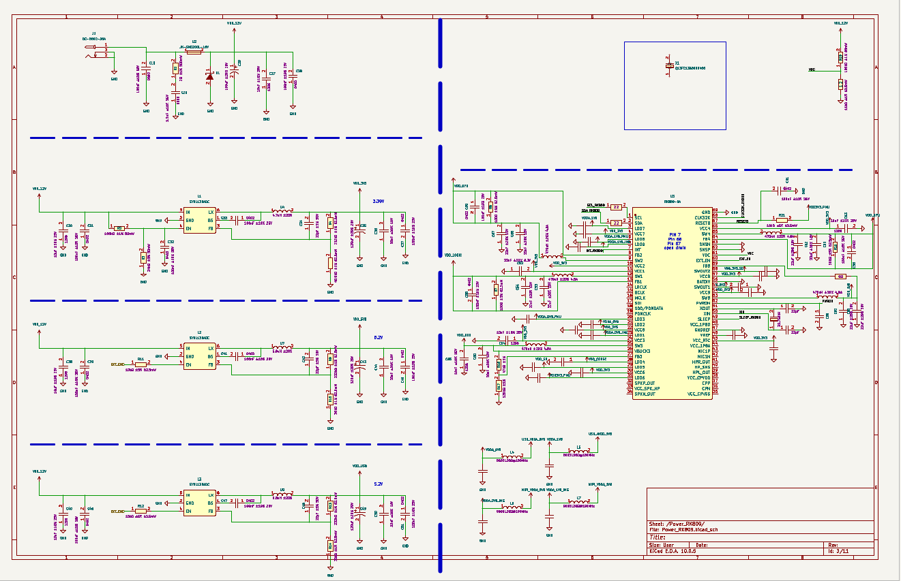

# ROCKY — RK3568 Linux Single-Board Computer

ROCKY is a custom application-class single-board computer built around the Rockchip RK3568. The project is intended to develop and demonstrate practical SoC hardware-design skills: multi-rail power architecture, PMIC integration, high-speed memory, storage, multimedia interfaces, PCB layout and eventual embedded-Linux bring-up.

> **Current status:** schematic design in progress. The power-unit schematic has been captured but the board has not yet been fabricated or electrically validated.

## Design direction

The board is being developed as a compact, media-oriented Linux platform rather than a copy of an existing reference design. The intended architecture includes:

- Rockchip RK3568 quad-core Arm Cortex-A55 SoC
- RK809 PMIC and the required power sequencing/control connections
- External DDR memory
- On-board non-volatile storage
- MicroSD support
- Audio codec and external audio interfaces
- Camera and display connectivity
- USB and Ethernet
- On-board generation of the main system rails from a 12 V input
- Debug and hardware bring-up access

## Power-unit schematic

The power sheet is divided into the front-end input stage, three discrete pre-regulators, the RK809 PMIC and the filtered analogue supplies.

### 12 V input and protection

Power enters through the DC jack and becomes the `VIN_12V` rail after the input-conditioning network. The front end includes input capacitance, a series filtering element, transient clamping and bulk/local decoupling. Together these parts reduce conducted noise, absorb short input transients and provide local energy for step changes in converter current.

This is protection and filtering, not galvanic isolation. Reverse-polarity behaviour, surge rating, fuse strategy and connector current rating still need to be checked as part of the final power review.

### Discrete buck pre-regulators

Three synchronous buck-converter stages derive the board's initial rails from `VIN_12V`:

| Nominal output | Intended role |
| --- | --- |
| 3.3 V | Main 3.3 V system/peripheral supply |
| 0.8 V | Low-voltage auxiliary rail required by the SoC power architecture |
| 5.2 V | Upstream supply/headroom for the 5 V domain and RK809 power path |

Each converter includes input decoupling, an enable network, bootstrap capacitor, switching inductor, feedback divider and output capacitors. The feedback divider sets the output voltage; the inductor and capacitors form the energy-transfer and ripple-filtering network.

The 5.2 V value is intentional at schematic stage to retain margin ahead of downstream distribution losses. It must be confirmed against every connected device's absolute-maximum and recommended operating limits before layout is frozen.

### RK809 PMIC

The RK809 supplies and supervises the multiple voltage domains needed by the RK3568 platform. Its buck and LDO outputs are separated by function so that core, memory, I/O and multimedia domains can receive the correct voltage and sequencing.

The sheet also includes:

- Local input and output decoupling for the PMIC supply groups
- I²C control connections between the RK3568 and RK809
- Interrupt, reset, sleep/power-control and power-key management signals
- The PMIC reference bypass network, which keeps the internal analogue reference quiet
- RTC-domain support and the low-frequency clock provision
- Codec-related supply decoupling associated with the RK809 audio block
- Ferrite-bead filtering for sensitive analogue/audio rails

The RK809 is therefore more than a bank of regulators: it is responsible for controlled power-up, power-down and low-power-state coordination with the processor.

### Design status and verification

This schematic documents the present design intent; it is not yet a validated production power tree. Before PCB layout is finalised, the following checks remain:

- Worst-case current budget and converter efficiency for every rail
- Inductor saturation current, capacitor derating and regulator thermal margin
- RK3568/RK809 sequencing requirements and default PMIC configuration
- Enable-state behaviour during plug-in, reset, sleep and shutdown
- Ripple/noise targets for DDR, PLL, analogue and audio domains
- Protection coverage, grounding strategy and high-current return paths
- Test points and a staged bring-up procedure for every major rail

## Current progress

### Completed

- Defined the initial system architecture and divided the schematic into functional hierarchical blocks.
- Created the KiCad project and imported the RK3568 symbol and BGA footprint.
- Checked the imported package dimensions and 0.65 mm ball pitch against the device documentation.
- Connected the RK3568 power and ground pins.
- Added the required local decoupling capacitors for the SoC supply domains.
- Captured the protected 12 V input and the discrete 3.3 V, 0.8 V and 5.2 V buck-converter stages.
- Added the RK809 PMIC power network, reference/RTC support and management connections.
- Connected the PMIC control signals, including the required open-drain interfaces.
- Added the first repository design artifact: the power-unit schematic shown above.

### In progress

- Completing and reviewing the RK809 audio-codec section and its analogue/digital support circuitry.
- Continuing schematic capture one subsystem at a time, with each interface checked against the RK3568 and peripheral documentation.
- Reviewing power sequencing, rail dependencies, current capacity and signal-voltage domains as the remaining blocks are added.

### Next stages

1. Complete the audio subsystem.
2. Add DDR memory and validate topology, pin mapping and power requirements.
3. Add boot/storage interfaces, including on-board flash and microSD.
4. Add Ethernet, USB, camera and display interfaces.
5. Complete clocks, reset, boot configuration and debug connections.
6. Run a full schematic, current-budget and power-sequencing review.
7. Define the PCB stack-up, placement strategy and breakout approach for the 0.65 mm-pitch BGA.
8. Route, verify, manufacture and bring up the hardware.
9. Develop the Linux boot and board-support configuration.

## Engineering objectives

This project is being used to build demonstrable competence beyond MCU-level designs, particularly in:

- Application-processor power architecture and sequencing
- PMIC integration
- DDR design constraints
- High-speed interface implementation
- Dense BGA breakout and multilayer PCB design
- Hardware bring-up and fault isolation
- Boot chain, device tree and embedded-Linux board support

## Project status summary

| Area | Status |
| --- | --- |
| System architecture | Initial definition complete |
| KiCad project structure | Complete |
| RK3568 symbol/footprint integration | Complete; continuing pin-level verification |
| SoC power, ground and decoupling | Complete at schematic stage |
| 12 V input and discrete pre-regulators | Schematic captured; verification pending |
| RK809 PMIC power/management connections | Schematic captured; sequencing review pending |
| Audio codec | In progress |
| DDR, storage and high-speed interfaces | Planned |
| PCB layout | Not started |
| Fabrication and bring-up | Not started |

The repository will be expanded with further schematic extracts, design decisions, PCB progress, manufacturing outputs and bring-up results as the project develops.
